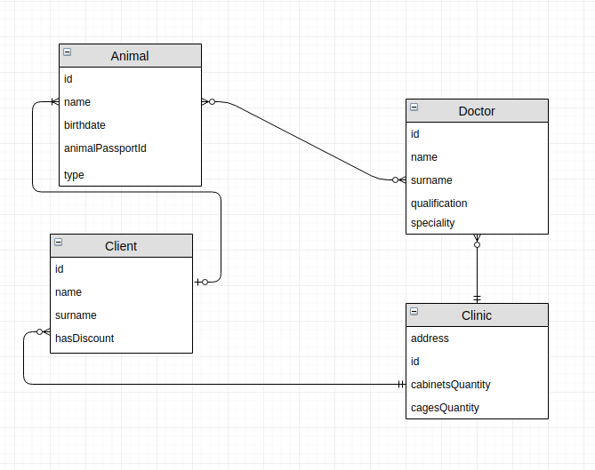

# Лабораторна робота No 1. Ознайомлення з базовими операціями СУБД PostgreSQL

## Предметна галузь

Ветеринарна клініка

## ER-діаграма

## Таблиці

### Animals

### Animals_Doctor

### Clients

### Clinics

### Doctors

