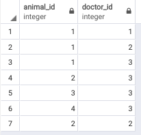

# Лабораторна робота No 1. Ознайомлення з базовими операціями СУБД PostgreSQL

## Предметна галузь

Ветеринарна клініка

## ER-діаграма

## Таблиці

### Animals

### Animals_Doctor

### Clients

### Clinics

### Doctors

## Опис структури бази даних

| Відношення | Атрибут | Тип даних |
|------------|---------|--------------------|
| _Відношення "**Animals**"_   Вміщує інформацію про тварин, що лікуються або лікувались в клініці | _id_ — унікальний номер тварини  _name_ — кличка тварини   _birthdate_ — дата народження тварини   _animal_passport_id_ — серія та номер паспорту тварини   _type_ — тип тварини   _owner_id_ — ідентифікатор хазяїна | Числовий   Текстовий  Дата   Текстовий   Текстовий   Числовий|
| _Відношення "**Clients**"_   Вміщує інформацію про клієнтів клініки | _id_ — унікальний ідентифікатор клієнту  _has_discount_ — наявність знижки  _clinic_id_ — ідентифікатор відділення, за якою закріплений клієнт   _name_ — ім'я клієнта   _surname_ — призвище кліента| Числовий   Булеан  Числовий   Текстовий  Текстовий |
| _Відношення "**Clinics**"_   Вміщує інформацію про відділення клінік| _id_ — унікальний номер клініки   _avaries_quantity_ — кількість вольєрів   _city_ — місто знаходження відділення   _street_ — вулиця знаходження відділення   _house_ — дім знаходження відділення | Числовий   Числовий   Текстовий   Текстовий   Текстовий |
| _Відношення "**Doctors**"_   Вміщує інформацію про докторів, що працюють в клініці | _id_ — унікальний номер доктора  _clinic_id_ — номер клініки, в якій працює доктор   _name_ — ім'я доктора   _surname_ — призвище доктора  _speciality_ — спеціальність доктора   _qualification_ — кваліфікація доктора | Числовий   Числовий   Текстовий   Текстовий   Текстовий   Текстовий
| _Відношення "**Animals_Doctors**"_   Вміщує інформацію про те, які тварини лікуються у яких докторів | _animal_id_ — номер тварини  _doctor_id_ — номер доктора | Числовий   Числовий

## Робоча програма
