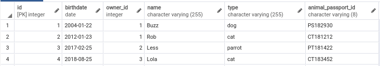

# Лабораторна робота No 3. Засоби оптимізації роботи СУБД PostgreSQL


## Варіант завданн

15 варіант згідно номера залікової книжки

| Види індексів | Умови для тригера    |
|---------------|----------------------|
| Hash, BRIN    | before delete, update|

## Предметна галузь

Ветеринарна клініка

## ER-діаграма


## Таблиці

### Animals

### Animals_Doctor

### Clients

### Clinics

### Doctors


## Опис структури бази даних

| Відношення | Атрибут | Тип даних |
|------------|---------|--------------------|
| _Відношення "**Animals**"_ <br> Вміщує інформацію про тварин, що лікуються або лікувались в клініці | <span style="color:red">_id_</span> — унікальний номер тварини<br> _name_ — кличка тварини <br> _birthdate_ — дата народження тварини <br> _animal_passport_id_ — серія та номер паспорту тварини <br> <span style="color:blue">_type_</span> — тип тварини <br> <span style="color:blue">_owner_id_</span> — ідентифікатор хазяїна | Числовий <br> Текстовий<br> Дата <br> Текстовий <br> Текстовий <br> Числовий|
| _Відношення "**Clients**"_ <br> Вміщує інформацію про клієнтів клініки | <span style="color:red">_id_</span> — унікальний ідентифікатор клієнту<br> _has_discount_ — наявність знижки<br> _clinic_id_ — ідентифікатор відділення, за якою закріплений клієнт <br> _name_ — ім'я клієнта <br> _surname_ — призвище кліента| Числовий <br> Булеан<br> Числовий <br> Текстовий<br> Текстовий |
| _Відношення "**Clinics**"_ <br> Вміщує інформацію про відділення клінік| <span style="color:red">_id_</span> — унікальний номер клініки <br> _avaries_quantity_ — кількість вольєрів <br> _city_ — місто знаходження відділення <br> _street_ — вулиця знаходження відділення <br> _house_ — дім знаходження відділення | Числовий <br> Числовий <br> Текстовий <br> Текстовий <br> Текстовий |
| _Відношення "**Doctors**"_ <br> Вміщує інформацію про докторів, що працюють в клініці | <span style="color:red">_id_</span> — унікальний номер доктора<br> _clinic_id_ — номер клініки, в якій працює доктор <br> _name_ — ім'я доктора <br> _surname_ — призвище доктора<br> _speciality_ — спеціальність доктора <br> _qualification_ — кваліфікація доктора | Числовий <br> Числовий <br> Текстовий <br> Текстовий <br> Текстовий <br> Текстовий
| _Відношення "**Animals_Doctors**"_ <br> Вміщує інформацію про те, які тварини лікуються у яких докторів | <span style="color:red">_animal_id_</span> — номер тварини<br> _doctor_id_ — номер доктора | Числовий <br> Числовий


## Завдання №2: команди створення індексів, тексти і час виконання запитів SQL

### Команди SQL створення індексів

```sql
CREATE INDEX IF NOT EXISTS hash_index ON "Animal" USING hash (name);

CREATE INDEX IF NOT EXISTS aviaries_brin_index ON "Clinic" USING brin (aviaries_quantity);
``` 

### SQL запити
```sql
Explain analyze select * from "Animal" where name = 'jqMJz695qx'
```


```sql
Explain analyze select * from "Clinic" where aviaries_quantity > 30 and aviaries_quantity < 50
```


## Завдання №3: команди, що ініціюють виконання тригера, текст тригера та скріншоти зі змінами у таблицях бази даних

### Код тригеру


### При видаленні тварини із бази даних, її ім'я заноситься в таблицю з видаленими тваринами

  
  
  

## Завдання №4: скріншоти з ходом виконання запитів та їх результатів у обох транзакціях по кожному рівню ізоляції

### READ COMMITTED

<table>
    <tr>
        <td>Transction #1</td>
        <td>Transction #2</td>
    </tr>
    <tr>
        <td>
            <pre lang="sql">
-- #1
BEGIN TRANSACTION ISOLATION LEVEL READ COMMITTED;
SELECT name FROM "Doctor" WHERE id = 6;
-- #2
<br>
<br>
-- #3
SELECT name FROM "Doctor" WHERE id = 6;
-- #4
<br>
-- #5
SELECT name FROM "Doctor" WHERE id = 6;
            </pre>
        </td>
        <td>
            <pre lang="sql">
-- #1
<br>
<br>
-- #2
BEGIN TRANSACTION ISOLATION LEVEL READ COMMITTED;
UPDATE "Doctor" SET name = 'Bogdan' WHERE id = 6;
-- #3
<br>
-- #4
COMMIT;
<br>
<br>
            </pre>
        </td>
    </tr>
</table>

| Transaction #1      | Transaction #2      |
|---------------------|---------------------|
|  |                     |
|                     |  |
|  |                     |
|                     |  |
|  |                     |

### REPEATABLE READ

<table>
    <tr>
        <td>Transction #1</td>
        <td>Transction #2</td>
    </tr>
    <tr>
        <td>
            <pre lang="sql">
-- #1
BEGIN TRANSACTION ISOLATION LEVEL REPEATABLE READ;
SELECT name FROM "Doctor" WHERE id = 6;
-- #2
<br>
<br>
<br>
-- #3
SELECT name FROM "Doctor" WHERE id = 6;
-- #4
COMMIT;
SELECT name FROM "Doctor" WHERE id = 6;
            </pre>
        </td>
        <td>
            <pre lang="sql">
-- #1
<br>
<br>
-- #2
BEGIN TRANSACTION ISOLATION LEVEL REPEATABLE READ;
UPDATE "Doctor" SET name = 'Andrii' WHERE id = 6;
COMMIT;
-- #3
<br>
-- #4
<br>
<br>
            </pre>
        </td>
    </tr>
</table>

| Transaction #1      | Transaction #2      |
|---------------------|---------------------|
|  |                     |
|                     |  |
|  |                     |
|  |                     |

### SERIALIZABLE

<table>
    <tr>
        <td>Transction #1</td>
        <td>Transction #2</td>
    </tr>
    <tr>
        <td>
            <pre lang="sql">
-- #1
BEGIN TRANSACTION ISOLATION LEVEL SERIALIZABLE;
SELECT COUNT(*) FROM "Doctor";
-- #2
<br>
<br>
<br>
<br>
-- #3
SELECT COUNT(*) FROM "Doctor";
-- #4
COMMIT;
SELECT COUNT(*) FROM "Doctor";
            </pre>
        </td>
        <td>
            <pre lang="sql">
-- #1
<br>
<br>
-- #2
BEGIN TRANSACTION ISOLATION LEVEL SERIALIZABLE;
INSERT INTO "Doctor" (name, surname, speciality, qualification, 
	clinic_id) VALUES ('Ihor', 'Vens', 'Surgeon', 'Master', null);
COMMIT;
-- #3
<br>
-- #4
<br>
<br>
            </pre>
        </td>
    </tr>
</table>

| Transaction #1      | Transaction #2      |
|---------------------|---------------------|
|   |                     |
|                     |   |
|   |                     |
|   |                     |
